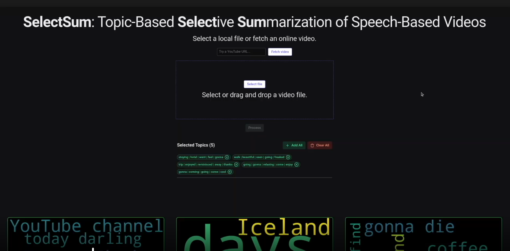
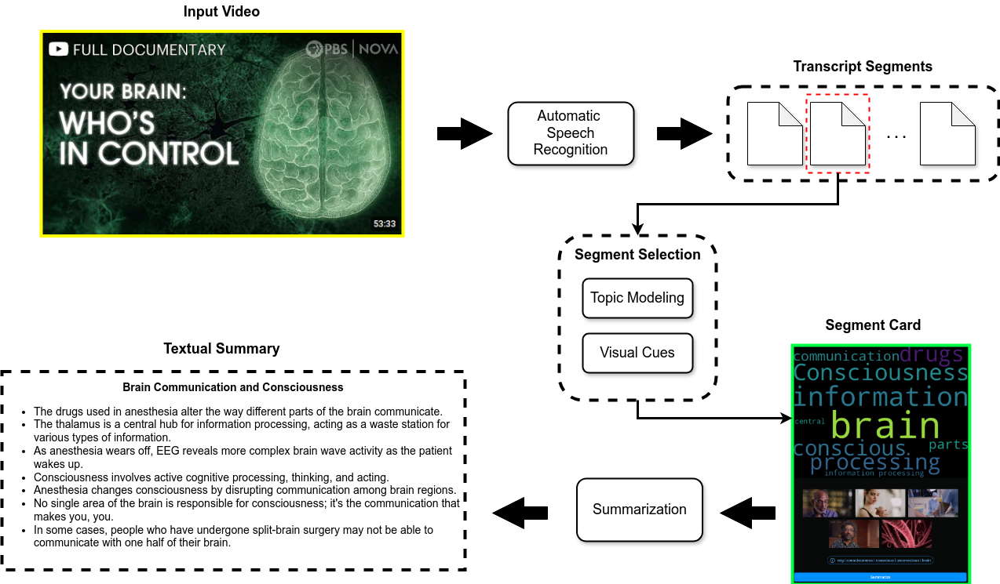

# SelectSum

> Topic-based selective summarization of speech-based videos - filter segments by topic, then summarize only what matters.

---

Official implementation of the paper "_SelectSum: Topic-Based Selective Summarization of Speech-Based Videos_" (accepted at MMM 2025).

---

[](https://drive.google.com/file/d/1L7OPbkpnVFIagM6zIQwdTviOjxQ3ptSt)

---

## About

SelectSum is a fully local, interactive web system for efficient textual summarization of speech-based videos. Rather than summarizing an entire transcript at once, which is computationally expensive and produces results that are hard to navigate, SelectSum lets users selectively summarize only the segments they care about.

The pipeline extracts and chunks a video's speech transcript into segments, assigns representative topics to each chunk, and enriches every segment with informative visual cues (keyframes and wordclouds). Users can then filter segments by topic and request on-demand LLM summaries for any subset of segments, significantly reducing inference time and computational cost.

---

## Pipeline

<!-- PLACEHOLDER: Replace with a simplified pipeline flow diagram -->


```
YouTube URL / Local Video
  ↓  yt-dlp / file upload
Video File
  ↓  ffmpeg + stable-whisper
Timestamped Transcript
  ↓  Word-count-based merging (~100 words)
Primary Segments
  ↓  BERTopic + sentence-transformers (BAAI/bge-base-en-v1.5)
Topic-Annotated Segments
  ↓  Topic + word-count-based merging (~800 words)
Final Segments
  ↓  YAKE keyword extraction → wordcloud
  ↓  OpenCV keyframe sampling (6 frames / segment)
Segments with Visual Cues
  ↓  Reflex UI — topic chip filter
Interactive Segment Cards
  ↓  On-demand: ffmpeg trim + local LLM (OpenAI-compatible API)
Trimmed Video Clip + Structured Summary (title + bullet points)
```

---

## Features

- **Selective summarization**: summarize only the segments you choose, not the entire video
- **Topic filtering**: BERTopic automatically groups segments into coherent topics; filter the view with a single click
- **Visual navigation aids**: each segment card shows sampled keyframes and a wordcloud so you can assess relevance at a glance
- **Fully local**: all models (transcription, topic modeling, LLM) run on your machine; no cloud API keys required
- **On-demand**: summaries are generated only when requested, keeping inference costs minimal
- **Dual input**: accepts YouTube URLs (via yt-dlp) or local video file uploads

---

## Tech Stack

| Category | Technology |
|---|---|
| **Web UI** | [Reflex](https://reflex.dev/) |
| **Video Download** | [yt-dlp](https://github.com/yt-dlp/yt-dlp) |
| **Transcription** | [stable-whisper](https://github.com/jianfch/stable-ts) (OpenAI Whisper with word-level timestamps) |
| **Topic Modeling** | [BERTopic](https://maartengr.github.io/BERTopic/), [sentence-transformers](https://www.sbert.net/) (`BAAI/bge-base-en-v1.5`), UMAP |
| **Keyword Extraction** | [YAKE](https://github.com/LIAAD/yake), [RAKE-NLTK](https://github.com/csurfer/rake-nltk) |
| **Wordcloud** | [wordcloud](https://github.com/amueller/word_cloud) |
| **Video / Audio Processing** | [ffmpeg-python](https://github.com/kkroening/ffmpeg-python), [opencv-python](https://github.com/opencv/opencv-python) |
| **Summarization** | OpenAI-compatible local LLM API + [instructor](https://github.com/jxnl/instructor) (structured output) |

---

## Project Structure

```
SelectSum/
├── TaSeSum/
│   ├── TaSeSum.py              # Main Reflex app & processing pipeline
│   ├── state.py                # State definitions (Segment, SummaryFields, CommonState)
│   └── components/
│       ├── upload.py           # Local video upload component
│       ├── download.py         # YouTube URL download component
│       ├── summary_card.py     # Per-segment card: keyframes, wordcloud, LLM summary
│       └── topic_chips.py      # Topic filter chip selector
├── src/
│   ├── downloading.py          # yt-dlp download wrapper
│   ├── transcription.py        # stable-whisper transcription
│   ├── audio_utils.py          # Audio extraction (ffmpeg)
│   ├── video_utils.py          # Video trimming & keyframe extraction (cv2)
│   ├── segment_utils.py        # Segment merging, keyframe/wordcloud attachment
│   ├── topic_modelling.py      # BERTopic topic assignment
│   ├── text_utils.py           # YAKE keyword extraction & wordcloud generation
│   └── summarization.py        # LLM summarization (OpenAI API + instructor)
├── notebooks/                  # Exploratory notebooks for each pipeline stage
├── rxconfig.py                 # Reflex configuration
└── requirements.txt            # Python dependencies
```

---

## Quickstart

### Prerequisites

1. **uv** - install from [docs.astral.sh/uv](https://docs.astral.sh/uv/getting-started/installation/):
   ```bash
   curl -LsSf https://astral.sh/uv/install.sh | sh
   ```

2. **FFmpeg** - install via your package manager:
   ```bash
   # Ubuntu / Debian
   sudo apt install ffmpeg

   # macOS
   brew install ffmpeg
   ```

3. **A local OpenAI-compatible LLM server** running on port `8001`. Any of the following work:
   - [Ollama](https://ollama.com/) (start with `ollama serve` and use the `/v1` endpoint)
   - [llama.cpp server](https://github.com/ggerganov/llama.cpp?tab=readme-ov-file#web-server)

   Make sure the server is reachable at `http://127.0.0.1:8001/v1` before running the app, or update the endpoint in `src/summarization.py`.

### Installation

```bash
git clone https://github.com/jobini/SelectSum.git
cd SelectSum
uv venv
uv pip install -r requirements.txt
```

### Run

```bash
uv run reflex init   # first time only — initialises Reflex project assets
uv run reflex run
```

Open your browser at `http://localhost:3000`, paste a YouTube URL or upload a local video, and click **Process**. Once processing is complete, use the topic chips to filter segments and click **Summarize** on any card to generate a summary on demand.

---

## Configuration

A few values are currently hardcoded and should be updated before running:

| Setting | File | Default |
|---|---|---|
| LLM API endpoint | `src/summarization.py` | `http://127.0.0.1:8001/v1` |
| Whisper model size | `TaSeSum/TaSeSum.py` | `"tiny"` (options: `small`, `medium`, `large`) |
| Topic embedding model | `src/topic_modelling.py` | `BAAI/bge-base-en-v1.5` |

---

## License

The SelectSum source code is released under the [MIT License](LICENSE).

### Third-Party Licenses

This project depends on components with their own licenses. Notable ones:

| Component | License | Link |
|---|---|---|
| BERTopic | MIT | [Details](https://github.com/MaartenGr/BERTopic/blob/master/LICENSE) |
| sentence-transformers | Apache 2.0 | [Details](https://github.com/UKPLab/sentence-transformers/blob/master/LICENSE) |
| stable-whisper | MIT | [Details](https://github.com/jianfch/stable-ts/blob/main/LICENSE) |
| FFmpeg | LGPL 2.1+ | [Details](https://ffmpeg.org/legal.html) |
| Reflex | Apache 2.0 | [Details](https://github.com/reflex-dev/reflex/blob/main/LICENSE) |
